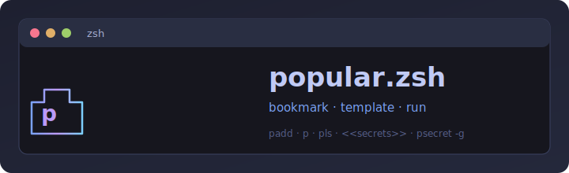

# popular.zsh



Tiny `zsh` shortcuts for saving, running, and templating your most-used commands—with optional **secret placeholders** kept out of exported command files.

Contributions are welcome; see [`CONTRIBUTING.md`](CONTRIBUTING.md). For responsible disclosure of security issues, see [`SECURITY.md`](SECURITY.md).

- Preview image: `assets/social-preview.png`
- Banner (SVG): [`assets/popular.svg`](assets/popular.svg)
- Wiki docs: [`docs/wiki/`](docs/wiki/)
- Launch post: [`docs/launch-post.md`](docs/launch-post.md)

It gives you:

- `padd` to save commands
- `paddh` to save a line from your shell history by event number
- `p` to run them (templates plus `<<secret>>` substitution)
- `pls` to list them in a clean view
- `premove` to remove them (and their per-command secrets)
- `pexport` / `pimport` to back up, share, or merge your saved commands (`pexport` never includes secrets)
- `psecret` / `psecret -g` to store sensitive values in a separate secrets file
- `pedit` / `pedit <name>` to edit the whole store or one command’s text (default editor: **vim**)
- `phelp` for a formatted reference in the terminal
- tab completion for saved names (`p`, `premove`, `pedit`, `pls` filters)
- tab completion for template options like `--class=`
- tab completion for `psecret` (command names and secret keys)
- `pupdate` to pull the latest `popular.zsh`, `install.sh`, and `lib/popular/*.zsh` from GitHub

## Layout

The entry script [`popular.zsh`](popular.zsh) sources modules under [`lib/popular/`](lib/popular/) (UI, store, templates, secrets, commands, completion). Keep that folder next to `popular.zsh` when you clone or copy the repo.

## Install

### Local

Add this line to your `~/.zshrc`:

```zsh
source /absolute/path/to/popular.zsh
```

Use the **directory** that contains both `popular.zsh` and `lib/popular/`.

Then reload your shell:

```zsh
source ~/.zshrc
```

### Curl install

```zsh
curl -fsSL https://raw.githubusercontent.com/sajjadRabiee/popular-zsh/main/install.sh | zsh
```

This mirrors the repo under `~/.popular-zsh/` (including `lib/popular/*.zsh`). Override the GitHub root with `POPULAR_REPO_BASE` if needed.

**Trust:** piping remote scripts into your shell runs whatever the URL returns. To reduce risk, clone the repo (or save `install.sh`, inspect it, then run it with `zsh install.sh`). Only point `POPULAR_REPO_BASE` at origins you trust—`pupdate` downloads from the same base.

After install, upgrade in place with **`pupdate`** (same `POPULAR_REPO_BASE`), then run **`source ~/.popular-zsh/popular.zsh`** (or your path).

## Commands

```zsh
padd <name> <command...>
paddh <history#> [name]
p <name> [options...]
pls [needle…]
premove <name>
pexport [file|-]
pimport [-r|--replace] <file>
psecret [-g|--global] <secret-key>
psecret <command-name> <secret-key>
pedit [name]
pupdate
phelp
```

## Examples

Save and run a simple command:

```zsh
padd gs git status
p gs
```

Save a templated command — **`[[port]]`** is a positional port; **`{{port}}`** uses `--port=`:

```zsh
padd serve 'python3 -m http.server [[port]]'
p serve 8000

padd serveo 'python3 -m http.server {{port}}'
p serveo --port=8000
```

Secrets stay **out** of the command store (good for sharing exports); values live beside your commands file (see **Storage**):

```zsh
padd ci 'curl -u "<<username>>:<<api-token>>" https://example.com/hook'
print -r 'myuser' | psecret -g username
print -r 'secret123' | psecret -g api-token
p ci
```

Save something you already ran (use the number from the first column of `history`):

```zsh
paddh 233
paddh 233 gs
paddh -1
```

Export and import the same plain-text store (`name|command` lines):

```zsh
pexport ~/popular-backup.txt
pimport ~/popular-backup.txt
pimport -r ~/popular-backup.txt   # replace entire store
```

On a TTY, `pimport` can ask whether new secrets should be saved **globally** (`psecret -g`) or **per command**, then prompts accordingly.

## Templates

Placeholders use **different** syntax for different calling styles:

- **`{{name}}`** — pass values as long options: `--name=value` (or `--name value`). Tab completion suggests these flags.
- **`[[name]]`** — pass values as **plain positional** arguments to `p`, in **left-to-right order** of each **distinct** `[[name]]` the first time it appears. Repeating the same `[[name]]` in the command still uses **one** value.
- **`{{name:value}}`** and **`[[name:value]]`** — optional inline **defaults** stored in the saved command (same file as the template). If you omit that argument when you run `p`, the default is used. You can still override with `--name=…` or an extra positional as usual. Values cannot contain `}` (curly) or `]` (bracket) respectively.
- **`<<name>>`** — **secrets**: substituted from `POPULAR_SECRETS_FILE` when you run `p`. **Global** rows (`psecret -g`) are checked **first**; per-command values are a fallback. Use letters, digits, `_`, and `-` inside `<< >>`.

```zsh
padd serve 'python3 -m http.server [[port]]'
p serve 8000

padd serve2 'python3 -m http.server {{port}}'
p serve2 --port=8000
```

Mixed example (positional args first in the template’s bracket order, then options):

```zsh
padd hit 'curl -s http://[[host]]:{{port}}/'
p hit localhost --port=8080
```

All-`{{}}` example:

```zsh
padd open-model 'my-tool generate --entity_class={{class}} --env={{env}}'
p open-model --class='my.app.models.User' --env=dev
```

### Quotes, pipes, and newlines

When you call `padd`, wrap the command in **single quotes** if it contains double quotes, spaces, or shell operators. For example: `padd x 'git commit -m "fix"'`. Commands are stored in a `name|command` file; **`|`**, **`\`**, **tabs**, and **newlines** in the command are escaped automatically so pipes and quotes round-trip. If you edit the file by hand, use `\|` for a literal pipe in the command text.

## Completion

If `compinit` is available, the script enables completion automatically:

- `p <TAB>` suggests saved command names
- `premove <TAB>`, `pedit <TAB>`, and `pls <TAB>` suggest saved command names (each filter word after `pls`)
- `pexport` and `pimport <TAB>` suggest file paths
- `p serve <TAB>` suggests **`--name=`** or **`--name=default`** when the template has **`{{name}}`** or **`{{name:default}}`** (not for `[[name]]` positional slots)
- `psecret <TAB>` then `<TAB>` suggests keys used in that command’s `<< >>` placeholders; after `-g`, suggests keys from across your store

## Storage

Saved commands live in:

```zsh
~/.popular_commands
```

Each line is `name|command`. The command part may contain escape sequences (`\\`, `\|`, `\t`, `\n`) produced by `popular.zsh` so the line stays unambiguous.

Secrets live in a **separate** file (default):

```zsh
${POPULAR_COMMANDS_FILE}.secrets
```

Rows are tab-separated; the file is chmod `600` when created. Values are **not** strongly encrypted—protection is mainly filesystem permissions and host security. **`pexport` only writes the command store**, never the secrets file—safe to share exports that use `<<placeholders>>`.

You can override paths with:

```zsh
export POPULAR_COMMANDS_FILE=/path/to/your/file
export POPULAR_SECRETS_FILE=/path/to/your/secrets
```

## Contributing

Bug reports, docs fixes, and pull requests are appreciated. Start with [`CONTRIBUTING.md`](CONTRIBUTING.md) for local setup, the install/`pupdate` path sync rule, and review expectations.

## Security

Short version: saved shortcuts are executed with **`eval`** after template expansion—treat your commands file and **`pimport`** sources like code you trust. Secrets are permission-protected, not encrypted at rest. Details and reporting steps are in [`SECURITY.md`](SECURITY.md).

## Project files

- [`popular.zsh`](popular.zsh) — bootstrap (sources `lib/popular/*.zsh`)
- [`install.sh`](install.sh)
- [`lib/popular/`](lib/popular/) — UI, store, templates, secrets, per-command modules, completion
- [`CONTRIBUTING.md`](CONTRIBUTING.md) — how to contribute
- [`SECURITY.md`](SECURITY.md) — threat model and vulnerability reporting
- [`assets/popular.svg`](assets/popular.svg) — README banner
- [`docs/launch-post.md`](docs/launch-post.md)
- [`docs/wiki/`](docs/wiki/)
